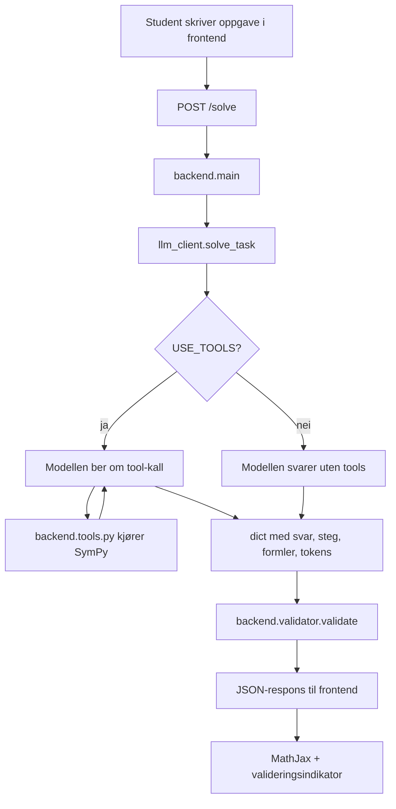

# MatteHjelpen – systembeskrivelse

*(Denne filen er et sammendrag av arkitekturen og et helhetsbilde. For å
faktisk fylle ut hver fil, bruk i stedet mal-promptene i
[`PROMPTS/`](PROMPTS/README.md) – én fil per modul, med krav dere selv må
fylle ut før dere sender prompten. Dette dokumentet er et **minimum**, ikke
en fasit: dere skal legge til egne krav om forklaringer og etterprøvbarhet,
og det er både forventet og greit at gruppers apper blir forskjellige.)*

Lag en webapp i Python som løser matteoppgaver for førsteårs ingeniørstudenter.

## Arkitektur
- Backend: FastAPI med ett endepunkt `POST /solve` som tar `{"oppgave": "..."}`.
- Frontend: én statisk `frontend/index.html` (vanilla JS, fetch mot backend),
  serveres av FastAPI (StaticFiles / FileResponse på `/`).
- LLM: et hvilket som helst OpenAI-kompatibelt API (f.eks. OpenRouter, OpenAI,
  eller en annen leverandør). Nøkkel, modellnavn og base-URL leses fra `.env`
  (`API_KEY`, `MODEL_NAME`, `API_BASE_URL`).

Kort fortalt:
- `llm_client.solve_task(...)` er orkestratoren. Den styrer turene mellom modell og verktøy.
- `backend.tools.py` gjør selve regningen med SymPy.
- `backend.validator.py` sjekker om løsningen faktisk holder numerisk.
- `solve_task(...)` returnerer en `dict` fordi `main.py` sender dette videre som JSON.
- `USE_TOOLS` er eksperimentbryteren. Den skal gjøre det lett å vise forskjellen mellom løsninger med og uten verktøy.
- Prinsippet «modellen regner aldri selv» gjelder BEREGNINGER. Bevis og
  begrepsforklaringer er legitime matteoppgaver appen bør svare på i tekst,
  men skal da si tydelig fra at svaret ikke er verifisert av et verktøy.

Et godt mentalt bilde er dette: modellen foreslår hvilken beregning som trengs,
`tools.py` utfører beregningen, og `validator.py` bekrefter at svaret passer
med oppgaven. `main.py` samler dette til én respons uten å skjule feil.

## Krav til backend
1. `backend/llm_client.py`: Kaller modellen med denne systemprompten:
   "Du er en matematikklærer for ingeniørstudenter. Bruk verktøyene (SymPy)
   til all beregning når oppgaven lar seg beregne slik – du skal ALDRI late
   som du har brukt et verktøy du ikke faktisk kalte. Kan oppgaven ikke
   beregnes (f.eks. et bevis eller en begrepsforklaring), resonnerer du i
   tekst og sier eksplisitt at svaret IKKE er verifisert av et verktøy.
   Forklar hvert steg pedagogisk på norsk, og oppgi nøyaktig hvilke
   formler/verktøy du faktisk brukte. Knytt hver formel-ID til steget der
   den brukes, og ta med navn og referanse fra formelsamlingen.
   Hvis du er usikker, si det eksplisitt."
   Gjør formelsamlingen tilgjengelig for modellen med ID, navn, formel,
   `bruk` og referanse. Implementer en tool-calling-løkke: send melding → hvis modellen ber om
   tool-kall, kjør funksjonen fra `tools.py`, legg resultatet tilbake i
   samtalen, og fortsett til modellen gir endelig svar. Bygg verktøyloggen
   ut fra faktiske tool-kall. La modellen oppgi formel-ID per steg, men
   kontroller ID-ene mot formelsamlingen og hent navn og referanse derfra.
   En gyldig referanse beviser ikke at formelen er brukt riktig.
2. `backend/tools.py`: Definer tools modellen KAN og SKAL bruke (function calling):
   - `derive(uttrykk, variabel)`
   - `integrate(uttrykk, variabel)`
   - `solve_equation(ligning, variabel)`
   - `solve_ode(ligning)`
   - `matrix_op(operasjon, matrise)` (determinant, invers, egenverdier, løs Ax=b)
   - `complex_op(operasjon, tall)` (polarform, potenser, røtter, Eulers formel)
   Alle implementert med SymPy. Returner både resultat og LaTeX.
3. `backend/validator.py`: Sett løsningen inn i originalproblemet numerisk
   (evaluer i 3 tilfeldige punkter med SymPy `subs`/`evalf`).
   Returner `validert: true/false` og detaljer.
4. `backend/formelsamling.py`: Dict med ~15 sentrale formler (derivasjonsregler,
   integrasjonsregler, karakteristisk ligning for ODE, Eulers formel,
   determinant, kjerneregel, delvis integrasjon). Dict-nøkkelen er formelens
   ID; hver oppføring har `navn`, `formel` (LaTeX), `referanse` og `bruk`.
5. Responsen fra `/solve` skal være JSON med: `svar`, `steg` (liste av strenger),
   `formler_brukt` (liste av gyldige formel-ID-er med navn og referanse,
   knyttet til relevante steg), `validert` (bool),
   `tokens_brukt` og `estimert_kostnad`.
6. `backend/main.py`: FastAPI-appen som kobler alt sammen, med CORS åpent for
   lokal utvikling og god feilhåndtering (vis feilmelding ærlig i responsen).

## Krav til frontend
`frontend/index.html`: Tekstfelt for oppgave, knapp «Løs», visning av stegvis
løsning (render LaTeX med MathJax fra CDN), liste over formler brukt,
grønn/rød valideringsindikator, og tokenforbruk + estimert kostnad nederst.
Enkelt og pent, ingen rammeverk.

Lag alle filene komplette og kjørbare med `uvicorn backend.main:app --reload`.
