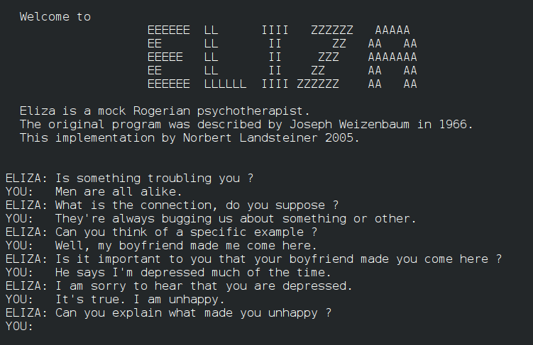

<!--
QUARTO-HURTIGGUIDE FOR DENNE PRESENTASJONEN

Hver overskrift på nivå 2 starter en ny foil:

## Tittel på foilen

Vanlig tekst, **utheving** og punktlister skrives som Markdown.

TYPISKE FOILMALER

1. Vanlig foil

## Kort og tydelig tittel

- Ett poeng per linje
- Hold teksten kort nok til å leses på avstand
- Bruk gjerne **utheving** på nøkkelord

2. To kolonner

[fire kolon] {.columns}
[tre kolon] {.column width="55%"}
Innhold i venstre kolonne.
[tre kolon]
[tre kolon] {.column width="45%"}
Innhold i høyre kolonne.
[tre kolon]
[fire kolon]

Erstatt plassholderne med tre eller fire kolon uten mellomrom. Antall kolon
må passe sammen. Ikke start en ny foil med ## før alle blokker er lukket.

3. Bilde

## Tittel

{width="70%" fig-alt="Kort beskrivelse av bildet"}

4. Kapittelfoil og trinnvis visning

## Ny del {.section-title .dark}

Tekst som skal vises ved neste klikk får klassen fragment:

[tre kolon] {.fragment}
Dette vises etter et klikk.
[tre kolon]

5. Talenotater som bare vises i speaker view (trykk S)

[tre kolon] {.notes}
Påminnelse til den som presenterer.
[tre kolon]

LATEX

Matematikk skrives direkte i Markdown. Inline matematikk skrives som
`$E = mc^2$`. En sentrert formel skrives på egne linjer med doble dollartegn:
`$$\int_0^1 x^2\,dx = \frac{1}{3}$$`. Quarto sender LaTeX-uttrykkene til
MathJax automatisk.

KJORBAR KODE

En Python-celle kan skrives slik. Kopier malen ut på ønsket foil og bytt
`.python` til `python` i klammeparentesen; da blir cellen kjørbar:

~~~{.python}
#| echo: true
#| output: true

verdier = [1, 2, 3, 4]
sum(verdier) / len(verdier)
~~~

Kjørbar Python krever Jupyter og en Python-kjerne i miljøet. Kjør deretter
`quarto preview forelesning_kort.qmd`. Vanlige kodeblokker uten `{python}`
blir bare vist som kode og blir ikke kjørt. Bruk `#| echo: false` for å
skjule kildekoden, eller `#| output: false` for å skjule resultatet.

FORHANDSVISNING

Fra mappen `foiler`:
`quarto preview forelesning_kort.qmd`

Quarto bygger på nytt når filen lagres. Last nettleseren på nytt dersom den
ikke oppdateres automatisk. `quarto render forelesning_kort.qmd` lager den
delbare HTML-filen `forelesning_kort.html`.
-->

## 1 — Før oppgaven {.section-title .dark}

## De neste to timene

::: {.journey}
::: {.journey-step}
<span>01</span>
**Forstå**

Hva gjør en språkmodell?
:::
::: {.journey-step}
<span>02</span>
**Avsløre**

Når og hvordan feiler den?
:::
::: {.journey-step}
<span>03</span>
**Forsterke**

Hva skjer med gode verktøy?
:::
::: {.journey-step}
<span>04</span>
**Ta ansvar**

Hva kan aldri delegeres til en kunstig intelligens?
:::
:::

## Ingeniørfaget i endring

::: {.big-statement}
Ingeniørens arbeid flyttes fra problemløsning, design og beregning mot problembeskrivelse, spesifikasjon, validering og vurdering av om vi får **riktig svar på riktig spørsmål**.
:::

::: {.compare-grid}
<div class="compare-side good">
<h3>Muligheten</h3>

- raske løsningsutkast og beregninger
- kode på sekunder
- presise gjengivelser av uklare, ufullstendige og inkonsistente ønsker og behov
- beslutningsgrunnlag i stor skala
- beslutninger i høyt tempo (om vi tillater det)
</div>
<div class="compare-side risk">
<h3>Risikoen</h3>

- skjulte valg og premisser
- skjult "sensur" av brukeren - ufullstendighet uttømmes og målkonflikt tildekkes
- presise svar på uklare spørsmål
- gode forklaringer selv om svaret er feil
- beslutninger vi ikke klarer å kontrollere
</div>
:::

## Kontrollproblemet i praksis

::: {.big-statement .compact}
Har du god nok kontroll til å kunne ta **ansvar** for resultatet?
:::

:::: {.columns}
::: {.column width="58%"}
### Spørsmål du må kunne besvare

- Hva gjorde KI på dine vegne?
- Hvilke premisser støttet den seg på?
- Hvordan resonnerte den?
- Hvilke valg gjorde den?
- Kan resultatet underlegges uavhengig kontroll?
:::
::: {.column width="42%"}
::: {.signal-stack}
<div><b>01</b><span>Forstå premissene</span></div>
<div><b>02</b><span>Kontroller prosessen</span></div>
<div><b>03</b><span>Ta ansvar for resultatet</span></div>
:::
:::
::::

## Turing og historien bak KI {background-image="img/alan_turing.jpg" background-size="cover" background-position="right center" .image-story .dark}

::: {.story-panel}
**1950** — Alan Turing spør: «Kan maskiner tenke?»

Men ordene *maskin* og *tenke* er uklare. Turing erstatter spørsmålet med en test:

Kan en maskin føre en samtale uten å bli avslørt som maskin?

::: {.story-question}
Han spør ikke hva tenkning **er**, men hvilken atferd vi vil godta som tegn på menneskelig intelligens.
:::
:::

## Turing så for seg maskiner som lærer

::: {.learning-machine}
<div class="learning-quote">
<span>Turings idé</span>
<b>Ikke prøv å bygg en ferdig «voksen hjerne».</b>
<p>Bygg en enklere «barnemaskin», og la den lære gjennom trening, erfaring, belønning og korrigering.</p>
<p>Dette er nærmere moderne maskinlæring enn ideen om å skrive inn all intelligens som regler.</p>
</div>
<div class="learning-loop">
<i>data</i><b>→</b><i>læring</i><b>→</b><i>atferd</i><b>↺</b>
</div>
:::

## Læring, svært forenklet

::: {.simple-equation}
$$\text{nye parametre}=\text{gamle parametre}-\eta\cdot\text{retning mot mindre feil}$$
:::

::: {.learning-steps}
<div><span>1</span><b>Prøv</b><small>Modellen lager et svar.</small></div>
<div><span>2</span><b>Mål feil</b><small>En tapsfunksjon gir et feiltall.</small></div>
<div><span>3</span><b>Juster</b><small>Parametrene flyttes litt.</small></div>
<div><span>4</span><b>Gjenta</b><small>Mange eksempler, mange ganger.</small></div>
:::

$\eta$ er **læringsraten**: hvor stort justeringssteg modellen tar. Den virkelige treningen er mer sammensatt, men denne løkken er kjernen.

## To veier til kunstig intelligens

::: {.ai-paths}
<div class="ai-path logic">
<span>1956 · Dartmouth</span>
<b>Logikk og regler</b>
<p>Feltets grunnleggere satser i stor grad på å beskrive kunnskap symbolsk og trekke slutninger etter eksplisitte regler.</p>
</div>
<div class="path-versus">↔</div>
<div class="ai-path learning">
<span>2017 → nå</span>
<b>Læring fra data</b>
<p>Læringsalgoritmer lærer statistiske representasjoner og mønstre fra enorme datamengder.</p>
</div>
:::

## Turing fikk rett

::: {.big-statement .compact}
Turing kjente fundamentale grenser for formelle regelsystemer, blant annet gjennom **stoppeproblemet**, og pekte i motsetning til Dartmouth-miljøet tidlig mot læring. Han fikk rett.
:::

::: {.timeline-strip}
<div><span>1950</span><b>Barnemaskinen</b><small>lære fra erfaring</small></div>
<i>→</i>
<div><span>1956</span><b>Symbolsk KI</b><small>logikk dominerer</small></div>
<i>→</i>
<div><span>2017 →</span><b>Transformere</b><small>læring skalerer til en generell form for språklig intelligens</small></div>
:::

Gjennombruddet betyr ikke at logikk er unyttig. Det betyr at **kjernen** i modellenes språkkompetanse og "intelligens" er basert på læringsalgoritmer, ikke eksplisitt regelstyrt.

## Er Turings test bestått?

::: {.test-stage}
<div class="test-person"><span>Menneske</span><b>?</b></div>
<div class="test-dialogue"><i>spørsmål</i><i>svar</i><i>oppfølging</i><i>forklaring</i></div>
<div class="test-machine"><span>Maskin</span><b>?</b></div>
:::

Store språkmodeller kan i mange samtaler være vanskelige å avsløre bare gjennom teksten.

- Oppstår det **forpliktelser** for oss som følge av dette? Epistemiske? Ontologiske? Moralske?
- Turing ville trolig ha svart ja...

## Parallellen Turing trekker

::: {.turing-question}
Ikke forhåndsdøm ut fra **hva noen er**. Vurder hva de faktisk er **i stand til å gjøre**.
:::

Turing kjente konsekvensen av å bli definert som «utenfor». Testen kan leses som en advarsel mot utenforskap for maskiner:

- Ikke avvis på forhånd fordi den er en maskin.
- Undersøk evnene gjennom det den faktisk gjør.
- Ikke undervurder maskinen bare fordi den er annerledes enn deg selv.

Turing vil tvinge oss til å ta maskinens prestasjon på alvor.

## Turing fryktet en annen type argument

::: {.turing-letter}
<blockquote>
“I’m afraid that the following syllogism may be used by some in the future.<br><br>
Turing believes machines think<br>
Turing lies with men<br>
Therefore machines do not think<br><br>
Yours in distress,<br>
Alan”
</blockquote>
<cite>Alan Turing, brev til Norman Routledge, 1952</cite>
:::

## Personen bak «syllogismen»

::: {.turing-biography}
<div><span>01</span><b>Turing var homofil</b><p>I Storbritannia var sex mellom menn straffbart.</p></div>
<div><span>02</span><b>Han ble dømt</b><p>I 1952 ble han utsatt for hormonbehandling, ofte omtalt som kjemisk kastrering.</p></div>
<div><span>03</span><b>Han døde i 1954</b><p>Dødsfallet ble konkludert som selvmord.</p></div>
:::

::: {.discussion-line}
Turings "syllogisme" er eksempel på en **non sequitur**, en tankefeil: Konklusjonen følger ikke av premissene. Turing vil advare om at følelser og fordommer kan erstatte vurderingen av hans argumenter.

- Hvorfor bruker han tenkende maskiner som eksempel, tror dere? Hvorfor ikke stopproblemet?
:::

## ELIZA: flytende språk kan lure oss

:::: {.columns}
::: {.column width="52%"}
{.editorial-image}
:::
::: {.column width="48%"}
**1966:** ELIZA speiler nøkkelord tilbake som en terapeut.

Teknikken er enkel, og systemet avsløres fort hvis man stiller gode spørsmål.
:::
::::

## Hvorfor kunne ELIZA likevel virke overbevisende?

::: {.eliza-effect}
<div><span>DET BRUKEREN MØTER</span><b>Flytende, oppmerksomt språk</b><p>Mange opplever at programmet <em>forstår</em> dem.</p></div>
<div><span>DET SYSTEMET GJØR</span><b>Finner og speiler nøkkelord</b><p>ELIZA består ikke Turing-testen hvis Turing stiller spørsmålene — men hva hvis noen andre gjør det?</p></div>
:::

::: {.callout-accent}
**ELIZA-effekten:** Vi tillegger maskinen forståelse uten å ha et godt grunnlag for det.
:::

## Samme mekanisme — motsatt fortegn

::: {.opposite-sign}
<div class="reject">
<span>Turing</span>
<b>Vi avviser maskinen</b>
<p>«Maskinen og dens forsvarer vekker motvilje — derfor kan ikke maskinen tenke.»</p>
</div>
<i>↔</i>
<div class="accept">
<span>ELIZA</span>
<b>Vi godtar maskinen</b>
<p>«Maskinen spiller en rolle som vekker tillit — derfor kan maskinen tenke.»</p>
</div>
:::

::: {.big-statement .compact}
Begge er **non sequitur**: En følelsesmessig reaksjon erstatter rasjonell vurdering av hva som faktisk foregår.
:::

## Ikke forhåndsdøm — ikke vær naiv

::: {.judgement-balance}
<div><span>Turings utfordring</span><b>Vurder evnen</b><p>Ikke avvis maskinen bare fordi den er annerledes.</p></div>
<i>+</i>
<div><span>ELIZAs advarsel</span><b>Undersøk mekanismen</b><p>Ikke tilskriv forståelse bare fordi du blir overbevist.</p></div>
:::

::: {.control-consequence}
Hvis en maskin kan utnytte våre forventninger — eller vi kan lure oss selv — blir **selvinnsikt, selvkritikk, kontroll og ansvar** enda viktigere.
:::

## Hva gjør en språkmodell?

::: {.generation-flow}
<div class="generation-step"><span>1</span><b>Deler opp</b><small>tekst → tokens</small></div>
<div class="generation-arrow">→</div>
<div class="generation-step"><span>2</span><b>Leser kontekst</b><small>hva hører sammen?</small></div>
<div class="generation-arrow">→</div>
<div class="generation-step"><span>3</span><b>Skårer</b><small>alle neste tokens</small></div>
<div class="generation-arrow">→</div>
<div class="generation-step accent"><span>4</span><b>Velger neste token</b><small>og gjentar</small></div>
:::

::: {.big-statement .compact}
En språkmodell genererer tekst **ett token om gangen**. Et token kan være et ord, en orddel eller et tegn.
:::

## «Paris er hovedstaden i ...»

::: {.probability-demo}
<div class="prompt-strip">Paris · er · hovedstaden · i · <b>?</b></div>
<div class="probability-bars">
  <div class="prob-row winner fragment"><span>Frankrike</span><i style="--p: 91%"></i><b>91 %</b></div>
  <div class="prob-row fragment"><span>Spania</span><i style="--p: 4%"></i><b>4 %</b></div>
  <div class="prob-row fragment"><span>Europa</span><i style="--p: 2%"></i><b>2 %</b></div>
  <div class="prob-row fragment"><span>landet</span><i style="--p: 1%"></i><b>1 %</b></div>
  <div class="prob-row other fragment"><span>andre</span><i style="--p: 2%"></i><b>2 %</b></div>
</div>
:::

::: {.micro-note}
Illustrative verdier.
:::

Modellen slår ikke opp fasiten. Den beregner en **sannsynlighetsfordeling** fra mønstre den har lært under trening.

Den er ikke en tradisjonell database eller kalkulator.

## Hvordan velges neste token?

::: {.selection-demo}
<div class="selection-visual">
  <div class="selection-wheel"></div>
  <div class="selection-legend" aria-label="Fargeforklaring for sannsynlighetsfordelingen">
  <div><i class="swatch-france"></i><span>Frankrike</span><b>91 %</b></div>
  <div><i class="swatch-spain"></i><span>Spania</span><b>4 %</b></div>
  <div><i class="swatch-rest"></i><span>andre</span><b>5 %</b></div>
  </div>
</div>
<div class="selection-copy">
  <b>1. Velg alltid toppen</b>
  <p>Da blir «Frankrike» valgt hver gang.</p>
  <b>2. Gjør en vektet trekning</b>
  <p>91 % betyr omtrent 91 treff på 100 like trekninger. Dette kalles ofte <em>sampling</em>.</p>
</div>
:::

Derfor kan samme prompt gi ulike svar. **Temperatur** endrer vektene før trekningen.

## Ett token blir mange koordinater

::: {.coordinate-stage}
<div class="coordinate-row geography"><b>Paris</b><i>0,82</i><i>−0,14</i><i>0,67</i><i>0,05</i><i>…</i><i>−0,31</i></div>
<div class="coordinate-row geography"><b>Madrid</b><i>0,78</i><i>−0,09</i><i>0,61</i><i>0,12</i><i>…</i><i>−0,27</i></div>
<div class="coordinate-row math"><b>derivere</b><i>−0,18</i><i>0,73</i><i>−0,04</i><i>0,81</i><i>…</i><i>0,42</i></div>
<div class="coordinate-axis"><span>dim. 1</span><span>dim. 2</span><span>dim. 3</span><span>dim. 4</span><span>…</span><span>dim. n</span></div>
:::

::: {.big-statement .compact}
En vektor er bare en lang liste med tall. Under trening lærer modellen koordinater som gjør nyttige språklige sammenhenger tilgjengelige for beregning.
:::

Tallene over er illustrative. Virkelige representasjoner har gjerne hundrevis eller tusenvis av dimensjoner.

## Avstand gjør likhet beregnbar

::: {.distance-stage}
<div class="distance-points">
  <i class="point paris">Paris</i>
  <i class="point madrid">Madrid</i>
  <i class="point derivative">derivere</i>
  <span class="distance-near">kort avstand</span>
  <span class="distance-far">lang avstand</span>
</div>
<div class="distance-formula">
$$d(\mathbf{a},\mathbf{b})=\sqrt{\sum_{k=1}^{n}(a_k-b_k)^2}$$
<p>Mindre $d$ betyr nærmere i dette forenklede målet.</p>
</div>
:::

Hver dimensjon bidrar litt. Avstanden samler forskjellene til **ett tall**. I praksis brukes også andre mål, særlig cosinuslikhet.

## Et forenklet vektorrom med mening

::: {.vector-explainer}
<div class="vector-space" role="img" aria-label="Forenklet todimensjonal projeksjon av et høydimensjonalt vektorrom">
  <span class="cluster cluster-places">steder og land</span>
  <span class="cluster cluster-math">matematikk</span>
  <span class="cluster cluster-language">språk</span>
  <i class="concept geography" style="--x:17%;--y:22%">Paris</i>
  <i class="concept geography" style="--x:31%;--y:31%">Frankrike</i>
  <i class="concept geography muted" style="--x:18%;--y:48%">Madrid</i>
  <i class="concept geography muted" style="--x:34%;--y:55%">Spania</i>
  <i class="concept math" style="--x:73%;--y:72%">derivere</i>
  <i class="concept math muted" style="--x:84%;--y:61%">integrere</i>
  <i class="concept math muted" style="--x:69%;--y:58%">funksjon</i>
  <i class="concept structure" style="--x:68%;--y:24%">hovedstad</i>
  <i class="concept structure muted" style="--x:82%;--y:29%">land</i>
</div>
<div class="vector-copy">
  <b>Vi presser rommet ned til 2D</b>
  <p>Projeksjonen mister informasjon, men kan vise noen mønstre.</p>
  <b>Nærhet og retning bærer struktur</b>
  <p>Representasjoner som brukes i beslektede sammenhenger, kan danne klynger og relasjoner.</p>
</div>
:::

::: {.micro-note}
Plasseringen er en pedagogisk illustrasjon — ikke reelle modelldata.
:::

## Konteksten flytter representasjonen

::: {.attention-demo}
<div class="context-sentence">
  <span>Studenten</span><span>løste</span><span class="focus">den</span><span>med</span><span class="target">Python</span>
</div>
<div class="attention-result">
  <span>Oppmerksomhet</span>
  <b>Hvilke tidligere tokens er relevante akkurat nå?</b>
</div>
:::

- Transformerens **attention** kombinerer informasjon fra konteksten.
- Derfor kan samme ord få ulik betydning i ulike setninger.
- Resultatet er en kontekstavhengig representasjon — ikke et oppslag i en ordbok.

## Attention som en form for vektet blanding

::: {.attention-formula-stage}
<div class="attention-weights">
  <span style="--weight:25%">Studenten <b>0,10</b></span>
  <span style="--weight:70%">løste <b>0,35</b></span>
  <span style="--weight:100%">den <b>0,50</b></span>
  <span style="--weight:12%">med <b>0,05</b></span>
</div>
<div class="attention-equation">
$$\mathbf{c}=\sum_i \alpha_i\mathbf{v}_i,\qquad \sum_i\alpha_i=1$$
<p>Kontekstvektoren $\mathbf{c}$ er en vektet blanding. Stor $\alpha_i$ betyr at token $i$ får stor betydning akkurat nå.</p>
</div>
:::

Dette er en **forenklet abstraksjon**. En transformer bruker flere attention-hoder og lærte transformasjoner, men ideen om kontekstavhengige vekter består.

## «Dyp» betyr mange lærte lag

::: {.deep-stack}
<div><span>Start</span><small>tokens blir vektorer</small></div>
<div><span>Lag 1</span><small>attention blander relevant kontekst</small></div>
<div><span>Lag 2 … N</span><small>representasjonen bearbeides igjen</small></div>
<div class="final"><span>$\mathbf h_t$</span><small>kontekst ved neste posisjon</small></div>
:::

Hvert lag får resultatet fra laget under og lager en ny versjon. **Dyp læring** betyr at mange lærte transformasjoner er stablet oppå hverandre.

::: {.deep-principle}
Attention velger hva som er relevant **på nytt i hvert lag**. Andre deler av laget omformer deretter informasjonen før neste lag.
:::

## Hvorfor hjelper flere lag?

::: {.depth-benefits}
<div><span>1</span><b>Flere bearbeidingstrinn</b><p>Senere lag kan bygge videre på mønstre tidligere lag allerede har gjort tilgjengelige.</p></div>
<div><span>2</span><b>Sammensatte sammenhenger</b><p>Modellen kan kombinere ord, referanser, struktur og betydning over flere trinn.</p></div>
<div><span>3</span><b>Fleksibel attention</b><p>Det som er relevant i ett lag, kan endres når representasjonen er blitt rikere.</p></div>
<div><span>4</span><b>Lært arbeidsdeling</b><p>Treningen justerer alle lag sammen mot lavere feil — uten at vi tildeler hvert lag én fast oppgave.</p></div>
:::

::: {.closing-line}
Vanskelig å karakterisere optimal dybde teoretisk. **God dybde finnes empirisk.**
:::

## Ikke alle tall er like lett å tolke

::: {.representation-roles}
<div><span>INNE I MODELLEN</span><b>Representasjoner</b><p>Lagene lærer nyttige mellomregninger uten at hvert tall må kunne tolkes av oss.</p></div>
<i>→</i>
<div><span>NÅR VI ANALYSERER</span><b>Avstand og cosinuslikhet</b><p>Hjelpemidler for å undersøke hvordan vektorer ligger i forhold til hverandre.</p></div>
<i>→</i>
<div><span>NÅR MODELLEN VELGER</span><b>Råskår → sannsynlighet</b><p>Utgangslaget rangerer kandidatene; softmax lager en fordeling.</p></div>
:::

::: {.closing-line}
Læringen får forme representasjonene etter sluttoppgaven. Vi velger mål og normalisering først når vi vet **hva tallene skal brukes til**.
:::

## Fra tekst til kontekstvektor

::: {.context-vector-stage}
<div class="logit-context"><span>Generert så langt</span><b>$x_{1:t}$</b><small>«Paris er hovedstaden i»</small></div>
<i>→</i>
<div class="logit-operation"><span>Mange lag</span><b>$f(\,\cdot\,)$</b><small>attention + lærte transformasjoner</small></div>
<i>→</i>
<div class="logit-context final"><span>Kontekstvektor</span><b>$\mathbf h_t=f(x_{1:t})$</b><small>modellens oppsummering ved neste posisjon</small></div>
:::

- $x_{1:t}$ er alle tokens modellen har sett eller generert så langt.
- $\mathbf h_t(x_{1:t})$ er en lært vektorrepresentasjon av denne konteksten.

## Skår for hvert mulig neste token

::: {.candidate-score}
$$z(x_i\mid x_{1:t})=\mathbf h_t(x_{1:t})\cdot\mathbf e_{\mathrm{ut}}(x_i)+b_i$$
:::

::: {.score-candidates}
<div class="logit-results">
  <span>$x_i=$ F <b>12,4</b></span>
  <span>$x_i=$ S <b>9,3</b></span>
  <span>$x_i=$ E <b>8,6</b></span>
</div>
<div class="score-symbols">
  <p><b>$x_i$</b> ett mulig neste token</p>
  <p><b>$\mathbf e_{\mathrm{ut}}(x_i)$</b> lært vektoroppslag for kandidaten</p>
  <p><b>$b_i$</b> lært justering for kandidaten</p>
  <p><b>$\mathbf h_t(x_{1:t})$</b> lært representasjon av kontekst </p>
</div>
:::

::: {.micro-note}
Treningen former både kontekstvektoren og tokenvektorene slik at skalarproduktet gir en nyttig skår. Vi trenger ikke velge et eget likhetsmål: **modellen lærer selv hvilke retninger og lengder som passer til neste-token-prediksjon**.
:::

## Fra skår til sannsynlighet

::: {.score-pipeline}
<div><span>Kontekstvektor</span><b>[0,21 · −0,08 · …]</b></div>
<i>→</i>
<div><span>Råskårer $z_i$</span><b>12,4 · 9,3 · 8,6 · …</b></div>
<i>→</i>
<div class="accent"><span>Softmax</span><b>91 % · 4 % · 2 % · …</b></div>
:::

::: {.formula-line}
$$P(\text{token}_i)=\frac{e^{z_i/T}}{\sum_j e^{z_j/T}}$$
:::

**Softmax** sammenligner alle skårene og normaliserer resultatet. **Temperaturen** $T$ bestemmer hvor mye skårforskjellene forsterkes eller dempes.

## Temperatur: hvor stor usikkerhet vil du ha?

::: {.temperature-grid}
<div class="temperature-case cool">
  <span>Lav temperatur</span><b>mer konsentrert</b>
  <div class="mini-bars"><i style="--h:95%"></i><i style="--h:18%"></i><i style="--h:8%"></i><i style="--h:4%"></i></div>
  <small>samme svar oftere</small>
</div>
<div class="temperature-case warm">
  <span>Høy temperatur</span><b>flatere fordeling</b>
  <div class="mini-bars"><i style="--h:72%"></i><i style="--h:54%"></i><i style="--h:38%"></i><i style="--h:28%"></i></div>
  <small>mer variasjon — kreativitet? — og mer risiko</small>
</div>
:::

Temperatur endrer bare **hvordan modellen velger** blant alternativene.

## Hvorfor virker språkmodeller så bra?

::: {.three-reasons}
<div><span>01</span><b>Mye trening</b><p>Modellen møter enorme mengder språk, kode og mønstre.</p></div>
<div><span>02</span><b>Rike representasjoner</b><p>Vektorene kan uttrykke mange språklige og semantiske sammenhenger.</p></div>
<div><span>03</span><b>Kontekst</b><p>Attention lar hvert nytt token bygge på relevante deler av det som kom før.</p></div>
:::

::: {.discussion-line}
Vi kan beskrive mekanismen. Hvor langt det rekker som forklaring på modellens «forståelse» er uklart.
:::

## Styrke og svakhet kommer fra samme sted

::: {.compare-grid}
<div class="compare-side good">
<h3>Mønstre den ofte mestrer</h3>

- forklare og omformulere
- bygge videre på en omfattende kunnskapsbase
- foreslå kode og fremgangsmåter
- generalisere til nye kombinasjoner

</div>
<div class="compare-side risk">
<h3>Sannsynlighet gir ingen garanti</h3>

- tilfeldigheter kan medføre feil
- modellen varsler ikke alltid usikkerhet
- tvetydig input kan tolkes feil
- modellen kan hallusinere, bygge selvsikkert videre på tilfeldige feil
</div>
:::

::: {.closing-line}
Som ved dimensjonering mot grensetilstander trenger vi **krav, kontroll og sikkerhetsmarginer**. Og når et svar kan bevises eller verifiseres med et verktøy, bør vi gjøre det.
:::

## Før vi demonstrerer: koble til {.demo-slide}

Demoene kaller en språkmodell direkte fra nettleseren. Nøkkelen lagres bare i minnet i denne fanen.

```{=html}
<div class="key-console">
  <label for="api-key">API-nøkkel</label>
  <div class="control-row">
    <input type="password" id="api-key" placeholder="sk-... eller sk-or-...">
    <span id="key-status" class="status-dot">●</span>
  </div>
  <label for="default-model">Standardmodell</label>
  <select id="default-model" data-model-select></select>
  <div id="key-hint" class="microcopy"></div>
</div>
<script src="https://cdn.jsdelivr.net/pyodide/v0.27.7/full/pyodide.js"></script>
<script>
window.API_KEY = "";
window.SYMPY_PROMISE = null;
window.DEFAULT_MODEL = "openai/gpt-4.1-mini";
const NORWEGIAN_INSTRUCTION = "Svar på norsk (bokmål) når det er faglig mulig, med mindre brukeren eksplisitt ber om et annet språk.";
const MODEL_CATALOG = [
  { id: "openai/gpt-4.1-nano", label: "GPT-4.1 nano", openai: true },
  { id: "openai/gpt-4.1-mini", label: "GPT-4.1 mini", openai: true },
  { id: "openai/gpt-4.1", label: "GPT-4.1", openai: true },
  { id: "openai/gpt-5-mini", label: "GPT-5 mini", openai: true },
  { id: "openai/gpt-5.6-sol", label: "GPT-5.6 Sol", openai: true },
  { id: "mistralai/ministral-3b-2512", label: "Ministral 3 3B", openai: false },
  { id: "google/gemma-3-12b-it", label: "Gemma 3 12B", openai: false },
  { id: "qwen/qwen3.5-35b-a3b", label: "Qwen 3.5 35B A3B", openai: false },
  { id: "deepseek/deepseek-v3.2", label: "DeepSeek V3.2", openai: false },
  { id: "meta-llama/llama-3.3-70b-instruct", label: "Llama 3.3 70B", openai: false }
];
function modelInfo(model) {
  return MODEL_CATALOG.find(candidate => candidate.id === model);
}
function apiConfig(model) {
  const key = window.API_KEY;
  const info = modelInfo(model);
  if (!info) return null;
  if (key.startsWith("sk-or-")) return { url: "https://openrouter.ai/api/v1/chat/completions", model, provider: "openrouter" };
  if (key.startsWith("sk-") && info.openai) return { url: "https://api.openai.com/v1/chat/completions", model: model.replace(/^openai\//, ""), provider: "openai" };
  return null;
}
function selectedModel(selectId = "default-model") {
  return document.getElementById(selectId)?.value || window.DEFAULT_MODEL;
}
document.addEventListener("DOMContentLoaded", () => {
  document.querySelectorAll("select[data-model-select]").forEach(select => {
    const preferred = select.dataset.default || window.DEFAULT_MODEL;
    select.replaceChildren(...MODEL_CATALOG.map(model => {
      const option = document.createElement("option");
      option.value = model.id;
      option.textContent = model.label + (model.openai ? " · OpenAI/OpenRouter" : " · OpenRouter");
      return option;
    }));
    select.value = preferred;
  });
  const defaultSelect = document.getElementById("default-model");
  defaultSelect?.addEventListener("change", event => {
    window.DEFAULT_MODEL = event.target.value;
    document.querySelectorAll("select[data-follow-default]").forEach(select => { select.value = window.DEFAULT_MODEL; });
  });
  const input = document.getElementById("api-key");
  if (!input) return;
  input.addEventListener("input", event => {
    window.API_KEY = event.target.value.trim();
    const status = document.getElementById("key-status");
    const hint = document.getElementById("key-hint");
    const valid = window.API_KEY.startsWith("sk-");
    status.className = "status-dot " + (window.API_KEY ? (valid ? "ready" : "warning") : "");
    hint.textContent = !window.API_KEY ? "" :
      window.API_KEY.startsWith("sk-or-") ? "OpenRouter-nøkkel gjenkjent" :
      valid ? "OpenAI-nøkkel gjenkjent" : "Nøkkelen må starte med sk- eller sk-or-";
  });
});
function renderMath(element, text) {
  const normalized = text
    .replace(/\$\$([\s\S]+?)\$\$/g, "\\[$1\\]")
    .replace(/\$([^$\n]+?)\$/g, "\\($1\\)");
  element.textContent = normalized;
  if (window.MathJax && window.MathJax.Hub) {
    MathJax.Hub.Queue(["Typeset", MathJax.Hub, element]);
  }
}
window.callModel = async function(model, messages, outputId, usageId, resultMode = "text") {
  const output = document.getElementById(outputId);
  if (!window.API_KEY) {
    output.textContent = "Lim inn en API-nøkkel på koble-til-foilen først.";
    return;
  }
  const config = apiConfig(model);
  if (!config) {
    const info = modelInfo(model);
    output.textContent = info && !info.openai && window.API_KEY.startsWith("sk-")
      ? info.label + " krever en OpenRouter-nøkkel."
      : "Ukjent nøkkelformat eller modell.";
    return;
  }
  output.classList.add("loading");
  output.textContent = "Modellen arbeider ...";
  const started = performance.now();
  try {
    const response = await fetch(config.url, {
      method: "POST",
      headers: { "Content-Type": "application/json", "Authorization": "Bearer " + window.API_KEY },
      body: JSON.stringify({
        model: config.model,
        messages: [{ role: "system", content: NORWEGIAN_INSTRUCTION }, ...messages],
        [config.provider === "openai" ? "max_completion_tokens" : "max_tokens"]: resultMode === "integer" ? 1200 : 800
      })
    });
    output.classList.remove("loading");
    if (!response.ok) {
      const details = await response.text();
      const hint = response.status === 401 ? "Ugyldig nøkkel?" :
        response.status === 429 ? "Rate limit eller tom saldo" :
        response.status === 404 ? "Modellen finnes ikke hos leverandøren" : "API-feil";
      output.textContent = "HTTP " + response.status + " — " + hint + "\n" + details.slice(0, 300);
      return;
    }
    const data = await response.json();
    const content = data.choices[0].message.content;
    if (content == null) {
      output.textContent = "Modellen ga ikke noe tekstsvar (kanskje pga. resonneringstokens). Prøv igjen eller velg en annen modell.";
    } else if (resultMode === "integer") {
      const finalMatch = content.match(/FINAL\s*:\s*(-?\d+)/i);
      const integers = content.match(/-?\d+/g);
      output.textContent = finalMatch ? finalMatch[1] : integers ? integers[integers.length - 1] : "Intet heltall funnet";
    } else {
      renderMath(output, content);
    }
    if (usageId && data.usage) {
      document.getElementById(usageId).textContent = data.usage.total_tokens + " tokens · " + Math.round(performance.now() - started) + " ms · " + config.model;
    }
  } catch (error) {
    output.classList.remove("loading");
    output.textContent = "Nettverksfeil: " + error;
  }
};
async function getSymPy() {
  if (!window.SYMPY_PROMISE) {
    window.SYMPY_PROMISE = loadPyodide({
      indexURL: "https://cdn.jsdelivr.net/pyodide/v0.27.7/full/"
    }).then(async pyodide => {
      await pyodide.loadPackage("sympy");
      return pyodide;
    });
  }
  return window.SYMPY_PROMISE;
}
async function executeMeaningTool(name, args, state) {
  const pyodide = await getSymPy();
  if (name === "evaluate_bose_integral") {
    const power = Number(args.power);
    if (![5, 11].includes(power)) {
      return { ok: false, error: "Kall verktøyet med power=5 eller power=11." };
    }
    pyodide.globals.set("requested_power", power);
    const exact = await pyodide.runPythonAsync(`
import sympy as sp
n = int(requested_power)
str(sp.simplify(sp.gamma(n + 1) * sp.zeta(n + 1)))
`);
    state.integrals[power] = exact;
    return { ok: true, power, exact, identity: "Gamma(n+1)*zeta(n+1)" };
  }
  if (name === "simplify_meaning_ratio") {
    if (!state.integrals[5] || !state.integrals[11]) {
      return { ok: false, error: "Beregn først integralene med power=5 og power=11." };
    }
    pyodide.globals.set("integral_5", state.integrals[5]);
    pyodide.globals.set("integral_11", state.integrals[11]);
    const exact = await pyodide.runPythonAsync(`
import sympy as sp
i5 = sp.sympify(integral_5)
i11 = sp.sympify(integral_11)
str(sp.simplify(sp.Rational(65, 4146) * i11 / i5**2))
`);
    state.final = exact;
    return { ok: true, exact };
  }
  return { ok: false, error: "Ukjent verktøy: " + name };
}
window.runMeaningWithTools = async function(outputId, usageId, model = window.DEFAULT_MODEL) {
  const output = document.getElementById(outputId);
  const usage = document.getElementById(usageId);
  if (!window.API_KEY) {
    output.textContent = "Lim inn en API-nøkkel på koble-til-foilen først.";
    return;
  }
  const config = apiConfig(model);
  if (!config) {
    const info = modelInfo(model);
    output.textContent = info && !info.openai && window.API_KEY.startsWith("sk-")
      ? info.label + " krever en OpenRouter-nøkkel."
      : "Ukjent nøkkelformat eller modell.";
    return;
  }
  const tools = [
    {
      type: "function",
      function: {
        name: "evaluate_bose_integral",
        description: "Bruk ekte SymPy til å beregne integralet I_n = integral fra 0 til uendelig av t^n/(exp(t)-1) dt eksakt via Gamma(n+1)*zeta(n+1).",
        parameters: {
          type: "object",
          properties: { power: { type: "integer", enum: [5, 11] } },
          required: ["power"],
          additionalProperties: false
        }
      }
    },
    {
      type: "function",
      function: {
        name: "simplify_meaning_ratio",
        description: "Bruk ekte SymPy til å forenkle (65/4146)*I_11/I_5^2 etter at begge integralene er beregnet.",
        parameters: { type: "object", properties: {}, additionalProperties: false }
      }
    }
  ];
  const messages = [
    { role: "system", content: NORWEGIAN_INSTRUCTION },
    {
      role: "system",
      content: "Du styrer en verktøydemo. Du SKAL: (1) kalle evaluate_bose_integral med power=5, (2) kalle samme verktøy med power=11, og (3) først deretter kalle simplify_meaning_ratio. Ikke regn selv og ikke skriv en utledning."
    },
    {
      role: "user",
      content: "Finn M for uttrykket (65/4146)*I_11/I_5^2, der I_n er integralet fra 0 til uendelig av t^n/(exp(t)-1) dt. Følg den pålagte verktøyoppskriften."
    }
  ];
  const state = { integrals: {}, final: null, calls: [] };
  output.classList.add("loading");
  output.textContent = "Laster SymPy og ber modellen velge verktøy ...";
  usage.textContent = "";
  try {
    await getSymPy();
    for (let round = 0; round < 7 && !state.final; round++) {
      const missing = [5, 11].filter(power => !state.integrals[power]);
      if (round > 0) {
        messages.push({
          role: "user",
          content: missing.length
            ? "Du mangler evaluate_bose_integral for power=" + missing.join(" og power=") + ". Kall manglende verktøy nå."
            : "Begge integralene er klare. Kall simplify_meaning_ratio nå."
        });
      }
      const availableTools = missing.length
        ? [{
            ...tools[0],
            function: {
              ...tools[0].function,
              parameters: {
                ...tools[0].function.parameters,
                properties: { power: { type: "integer", enum: missing } }
              }
            }
          }]
        : [tools[1]];
      const response = await fetch(config.url, {
        method: "POST",
        headers: { "Content-Type": "application/json", "Authorization": "Bearer " + window.API_KEY },
        body: JSON.stringify({
          model: config.model,
          messages,
          tools: availableTools,
          tool_choice: "required",
          [config.provider === "openai" ? "max_completion_tokens" : "max_tokens"]: 500
        })
      });
      if (!response.ok) throw new Error("HTTP " + response.status + ": " + (await response.text()).slice(0, 180));
      const data = await response.json();
      const assistant = data.choices[0].message;
      const toolCalls = assistant.tool_calls || [];
      if (!toolCalls.length) throw new Error("Modellen returnerte ingen verktøykall.");
      messages.push({ role: "assistant", content: assistant.content || null, tool_calls: toolCalls });
      for (const toolCall of toolCalls) {
        let args = {};
        try { args = JSON.parse(toolCall.function.arguments || "{}"); } catch {}
        const result = await executeMeaningTool(toolCall.function.name, args, state);
        state.calls.push(toolCall.function.name + (args.power ? "(" + args.power + ")" : "()"));
        messages.push({ role: "tool", tool_call_id: toolCall.id, content: JSON.stringify(result) });
      }
      usage.textContent = state.calls.join(" → ");
    }
    if (state.final !== "42") throw new Error("Verktøyløkken fullførte ikke med eksakt resultat 42.");
    output.classList.remove("loading");
    output.classList.add("verified");
    output.textContent = state.final;
    usage.textContent += " · ekte SymPy · eksakt";
  } catch (error) {
    output.classList.remove("loading");
    output.textContent = "Verktøydemo feilet: " + error.message;
  }
};
</script>
```

::: {.privacy-line}
Bruk en nøkkel med lav kostnadsgrense. Ikke del den. Slett den etter forelesningen.
:::

## Demo 1 — Kan modellen regne? {.demo-slide}

```{=html}
<div class="demo-shell">
  <div class="control-row">
    <input id="q1" value="Hva er 417 × 383? Svar kun med tallet.">
    <select id="m1" data-model-select data-follow-default></select>
    <button onclick="callModel(document.getElementById('m1').value,[{role:'user',content:document.getElementById('q1').value}],'out1','tok1')">Spør modellen</button>
  </div>
  <div id="out1" class="llm-out"></div>
  <div id="tok1" class="usage-line"></div>
</div>
```

::: {.answer-reveal .fragment}
Fasit: **159 711**. Prøv større tall. Legg merke til hvordan modellen uttrykker feil.
:::

## Demo 2 — Systemprompten endrer svaret {.demo-slide}

```{=html}
<div class="demo-shell">
  <label for="sys2">Systemprompt</label>
  <textarea id="sys2">Du er en matematikklærer. Forklar hvert steg pedagogisk. Oppgi hvilke regler du bruker. Skriv matematikk som LaTeX. Hvis du er usikker, si det.</textarea>
  <div class="control-row">
    <input id="q2" value="Deriver f(x) = x² sin(x)">
    <button onclick="callModel(window.DEFAULT_MODEL,[{role:'system',content:document.getElementById('sys2').value},{role:'user',content:document.getElementById('q2').value}],'out2','tok2')">Kjør</button>
  </div>
  <div id="out2" class="llm-out scroll-output"></div>
  <div id="tok2" class="usage-line"></div>
</div>
```

::: {.answer-reveal .fragment}
Slett systemprompten og kjør igjen. Hva forsvant? Ikke nødvendigvis svaret — men **etterprøvbarheten**.
:::

## Demo 3 — Modellduell {.demo-slide .duel-slide}

```{=html}
<div class="demo-shell">
  <textarea id="q3" class="puzzle-text" rows="4">Peder, Marte og Lars er ingeniørstudenter som testet hver sin app for innlevering 1. Vi antar at de som består innlevering 1 alltid snakker sant, mens de som ikke består alltid lyver. Peder sa: «Minst én av de to andre besto ikke.» Marte sa: «Peder og jeg fikk samme resultat.» Lars sa: «Nøyaktig én av oss tre besto.» Hvem besto?</textarea>
  <div class="control-row centered">
    <button onclick="callModel(selectedModel('m3a'),[{role:'user',content:document.getElementById('q3').value}],'out3a','tok3a');callModel(selectedModel('m3b'),[{role:'user',content:document.getElementById('q3').value}],'out3b','tok3b')">Start duellen</button>
  </div>
  <div class="duel-grid">
    <div><select id="m3a" data-model-select data-follow-default></select><div id="out3a" class="llm-out duel-output"></div><div id="tok3a" class="usage-line"></div></div>
    <div><select id="m3b" data-model-select data-default="openai/gpt-5.6-sol"></select><div id="out3b" class="llm-out duel-output"></div><div id="tok3b" class="usage-line"></div></div>
  </div>
</div>
```

::: {.answer-reveal .fragment}
Fasit: **Peder og Marte besto, Lars besto ikke.** Martes utsagn gir at Peder besto uansett. Da kan Lars ikke snakke sant, og siden Lars lyver, besto flere enn én.
:::

## Demo 4 — Samme spørsmål, ulik arbeidsmåte {.demo-slide}

```{=html}
<div class="demo-shell">
  <div class="demo-method-note">Samme skjulte integral. Venstre genererer ett tall; høyre lar modellen be SymPy om tre verktøykall.</div>
  <div class="control-row centered">
    <button class="secondary" onclick="callModel(window.DEFAULT_MODEL,[{role:'system',content:'Regn uten kalkulator, kode eller andre verktøy. Ikke vis utledning eller forklaring. Svar i formatet FINAL: heltall.'},{role:'user',content:'La s(t)=t^5/(exp(t)-1). Finn nærmeste heltall til (65/4146) ganger integralet fra 0 til uendelig av t^6*s(t) dt, delt på kvadratet av integralet fra 0 til uendelig av s(t) dt. Ikke bruk verktøy. Svar bare FINAL: heltall.'}],'out4a','tok4a','integer')">Modellen svarer direkte</button>
    <button onclick="runMeaningWithTools('out4b','tok4b',window.DEFAULT_MODEL)">Modell + SymPy-verktøy</button>
  </div>
  <div class="duel-grid">
    <div><h3>Språkmodell</h3><div id="out4a" class="llm-out compact-output"></div><div id="tok4a" class="usage-line"></div></div>
    <div><h3>Funksjonskall</h3><div id="out4b" class="llm-out compact-output"></div><div id="tok4b" class="usage-line"></div></div>
  </div>
</div>
```

::: {.answer-reveal .fragment .answer-42}
Riktig svar er **42**.
:::

::: {.answer-reveal .fragment .question-reveal}
Men hva var spørsmålet?
:::

::: {.answer-reveal .fragment .equation-reveal}
$\displaystyle \mathcal M=?\qquad
\mathcal M:=\frac{65}{4146}\,
\frac{\int_0^\infty t^6\dot S_{\mathrm{local}}(t)\,dt}
{\left(\int_0^\infty \dot S_{\mathrm{local}}(t)\,dt\right)^2},
\qquad \dot S_{\mathrm{local}}(t)=\frac{t^5}{e^t-1}$
:::

::: {.microcopy .fragment .meaning-note}
Akkumulert «mening» i et selvorganiserende dissipativt system — ikke en fysisk lov.
:::

## Slik sikret vi verktøybruk - hva kan vi **garantere**? {.tool-prompt-slide}

```js
const messages = [
  {
    role: "system",
    content: `Du SKAL:
      1. kalle evaluate_bose_integral med power=5
      2. kalle samme verktøy med power=11
      3. først deretter kalle simplify_meaning_ratio
      Ikke regn selv og ikke skriv en utledning.`
  },
  {
    role: "user",
    content: `Finn M for (65/4146)*I_11/I_5^2,
      der I_n er integralet av t^n/(exp(t)-1).
      Følg den pålagte verktøyoppskriften.`
  }
];

const request = {
  messages,
  tools: availableTools,
  tool_choice: "required"
};
```

::: {.tool-prompt-note}
**Systemmeldingen instruerer.** `tools` avgrenser hva modellen kan kalle. `tool_choice: "required"` nekter modellen å svare uten et verktøykall.
:::

## Men verktøy løser ikke alt

::: {.ambiguity-stage}
<div class="expression">sin<sup>−1</sup>(x)</div>
<div class="branch fragment"><b>Tolkning A:</b><span>arcsin(x)</span></div>
<div class="branch fragment"><b>Tolkning B:</b><span>1 / sin(x)</span></div>
:::

SymPy kan regne feilfritt på **feil problem**.

Derfor må appen vise hva den har tolket, og studenten må kunne vurdere tolkningen.

## MatteHjelpen {.section-title .dark}

## Systemet dere skal bygge

::: {.system-flow}
<div class="flow-node student"><span>01</span><b>Student</b><small>formulerer oppgaven</small></div>
<div class="flow-arrow">→</div>
<div class="flow-node model"><span>02</span><b>Språkmodell</b><small>tolker og velger metode</small></div>
<div class="flow-arrow tool-arrow"><small>verktøykall</small>→</div>
<div class="flow-node tool"><span>03</span><b>SymPy</b><small>regner deterministisk</small></div>
<div class="flow-arrow">→</div>
<div class="flow-node verify"><span>04</span><b>Validator</b><small>prøver å motbevise svaret</small></div>
:::

<div class="feedback-line"><span>resultat tilbake til modellen</span></div>

::: {.architecture-caption}
Modellen tolker, velger og forklarer. SymPy regner. Validatoren kontrollerer det den faktisk kan kontrollere.
:::

## Oppgaven handler ikke (bare) om å lage en app

::: {.deliverables}
<div><span>A · 40 %</span><b>Bygge</b><p>Formuler noen krav og spørsmål som lar KI generere en fungerende applikasjon i henhold til spesifikasjonene.</p></div>
<div><span>B · 30 %</span><b>Teste</b><p>Kartlegg systemet med kontrollerte eksperimenter i tillegg til å vurdere koden så langt dere er i stand til det.</p></div>
<div><span>C · 30 %</span><b>Reflektere</b><p>Ta stilling til hvor mye tillit dere kan ha til det dere har bygget, og hvor mye ansvar dere kan påta dere for det dere har bygget.</p></div>
:::

::: {.closing-line}
Dere kan bruke så mye KI dere vil. Men dere skal **dokumentere bruken, forklare løsningen og innestå for alt dere leverer**.
:::

## Del A — bygg inn så mye kontroll som mulig

::: {.assignment-requirements}
<div><span>01</span><b>Verktøy</b><small>All symbolsk og numerisk beregning via SymPy (kan dere stole på SymPy?).</small></div>
<div><span>02</span><b>Forklaring</b><small>Reelle steg og faktiske formelreferanser.</small></div>
<div><span>03</span><b>Validering</b><small>Test løsningen — se om språkmodellen svarer ærlig når den ikke finner svaret, eller ikke kan verifisere det godt nok.</small></div>
<div><span>04</span><b>Grensesnitt</b><small>Vis svar, kontrollstatus, tokens og kostnad.</small></div>
:::

Bevis og begrepsforklaringer kan ikke alltid verifiseres av SymPy. Da er et ærlig **«ikke verifisert»** bedre enn et falskt grønt lys.

## Del B — brytere som kan gi større innsikt i systemet

::: {.switchboard}
<div><span class="switch off"></span><b>Skru av tools</b><small>Hva skjer med feilraten?</small></div>
<div><span class="switch on"></span><b>Bytt modell</b><small>Kvalitet, tid og pris?</small></div>
<div><span class="switch on"></span><b>Fjern stegkravet</b><small>Blir appen en svart boks?</small></div>
<div><span class="switch off"></span><b>Tvetydig input</b><small>Hva valideres egentlig?</small></div>
<div><span class="switch off"></span><b>Fremprovoser feil</b><small>Er grensesnittet ærlig?</small></div>
<div><span class="switch on"></span><b>Be om et bevis</b><small>Kjenner systemet sin grense?</small></div>
:::

Test **minst to modeller** på **ti oppgaver**. Logg riktig/feil, tools, validering, tokens og observasjoner i `EKSPERIMENT.md`.

## Del C — bruk deres egne funn

::: {.reflection-questions}
<div><span>HJELPEMIDDEL</span><b>Når støtter appen læring — og når erstatter den læringen?</b></div>
<div><span>TILLIT</span><b>Hva må dere kunne for å oppdage at systemet tar feil?</b></div>
<div><span>ANSVAR</span><b>Ville dere brukt det til å dimensjonere en bro?</b></div>
<div><span>KOMPETANSE</span><b>Hva betyr det å være faglig dyktig når produksjonen kan delegeres?</b></div>
:::

Ikke en matteprøve eller en prøve i programmering, men en øvelse i å **spesifisere, undersøke, kontrollere og begrunne** i samarbeid med en språkmodell.

## Før dere går i gang

1. Opprett gruppens repo fra templaten
2. Åpne i Codespaces eller VS Code
3. Konfigurer gratis API-tilgang i `.env`
4. Fyll ut **[FYLL INN SELV]** før dere prompter
5. Bruk promptene én modul om gangen
6. Kjør `python scripts/selftest.py` etter hver modul
7. Commit jevnlig — og start eksperimentloggen med første test

::: {.closing-line}
Målet er ikke å få grønt lys, men å krysse veien uten å bli ...
:::

## 2 — Erfaringer og veien videre {.section-title .dark}

## Erfaringer?

::: {.retro-grid}
<div><b>01</b><span>Hva overrasket mest da dere skrudde av tools?</span></div>
<div><b>02</b><span>Når var «validert» misvisende eller umulig?</span></div>
<div><b>03</b><span>Hvilket eget valg fikk størst konsekvens?</span></div>
<div><b>04</b><span>Hva kostet ti oppgaver i tokens — og hva sier det om skaleringspotensialet?</span></div>
:::

::: {.discussion-line}
Hva var det som **ikke virket**? Dette er ofte mest interessant.
:::

## Fire poenger dere forhåpentligvis vil ta med dere videre

::: {.experiment-lessons}
<div><span>TOOLS</span><b>Godt arbeid krever riktig bruk av verktøy, også når språkmodellen skal gjøre jobben.</b></div>
<div><span>TOLKNING</span><b>Et perfekt verktøy kan regne feilfritt på **feil problem**.</b></div>
<div><span>VALIDERING</span><b>En kontroll avdekker alltid noe, men aldri alt, og du vet ikke alltid hva den faktisk avdekker.</b></div>
<div><span>DESIGN</span><b>Usikkerhet må vises — ikke skjules.</b></div>
:::

## To prinsipper

::: {.principle-pair}
<div><span>1</span><h3>Generering + kontroll</h3><p>Modellen lager kandidater. Verktøy og tester avviser noen av dem.</p></div>
<div><span>2</span><h3>Kontroll + ansvar</h3><p>En bestått test fritar ingen fra å vurdere om testen var relevant.</p></div>
:::

## Da teknologien løp foran rutinene {.section-title .dark}

## Tay-broen, 28. desember 1879 {background-image="img/tay_bridge_down.jpg" background-size="cover" .image-story .dark}

::: {.story-panel .lower-left}
Verdens lengste bro raste i storm mens et passasjertog var midt på den.

**Rundt 75 mennesker omkom.** Granskingen fant svikt i konstruksjon, bygging, vedlikehold — og manglende beregning av vindlast.
:::

## Mange katastrofer, samme mønster.

::: {.gallery-grid}
::: {.gallery-item}


**Ashtabula · 1876**<br>
Ny type konstruksjon. Svak kontroll. 92 omkom.
:::
::: {.gallery-item}


**Tay · 1879**<br>
Vindlast, utførelse og vedlikehold sviktet. Rundt 75 omkom.
:::
::: {.gallery-item}


**Quebec · 1907**<br>
Varsler ble sett, men systemet reagerte ikke. 75 omkom.
:::
:::

## Systemsvikt - ikke (bare) dårlig ingeniørarbeid eller mangelfull teknologi

::: {.failure-chain}
<div><span>MODELL</span><b>Hva var utelatt?</b><small>vind · last · materialer</small></div>
<i>→</i>
<div><span>PROSESS</span><b>Hvem kontrollerte?</b><small>tegning · utførelse · avvik</small></div>
<i>→</i>
<div><span>ORGANISASJON</span><b>Hvem kunne stoppe?</b><small>kompetanse · myndighet · ansvar</small></div>
:::

## Hva gjorde samfunnet?

::: {.response-ring}
<div><span>1</span><b>Standarder</b><small>felles krav og sikkerhetsmarginer</small></div>
<div><span>2</span><b>Kompetanse</b><small>profesjoner og kvalifikasjoner</small></div>
<div><span>3</span><b>Uavhengig kontroll</b><small>andre øyne før konsekvens</small></div>
<div><span>4</span><b>Ansvar</b><small>sporbar beslutning og ansvarlig aktør</small></div>
:::

Teknologien ble ikke trygg fordi den ble perfekt. Den ble tryggere fordi **systemet rundt den** ble bedre.

## Behov for noe tilsvarende som i MatteHjelpen

::: {.bridge-to-app}
<div><span>BRO</span><b>Lastmodell</b><i>→</i><b>Beregning</b><i>→</i><b>Kontroll</b></div>
<div><span>APP</span><b>Tolkning</b><i>→</i><b>SymPy</b><i>→</i><b>Validering</b></div>
:::

::: {.big-statement .compact}
Ingeniøren må kontrollere om **resultatet** er bra nok, og **styre** modellen helt til det oppnås god nok kvalitet. Systemet rundt må sikre at dette blir gjort på en forsvarlig måte, med uavhengig kontroll.
:::

## Fra brostandarder til KI-styring {.section-title .dark}

## Regelverket differensierer ut fra risiko

::: {.risk-logic}
<div><span>1</span><b>Hva kan gå galt?</b><small>feil · diskriminering · lekkasje · misbruk</small></div>
<i>→</i>
<div><span>2</span><b>Hvem rammes?</b><small>enkeltperson · virksomhet · samfunn</small></div>
<i>→</i>
<div><span>3</span><b>Hvor alvorlig?</b><small>sannsynlighet × konsekvens</small></div>
<i>→</i>
<div><span>4</span><b>Hvilke barrierer?</b><small>krav · logging · tilsyn · stopp</small></div>
:::

Samme modell kan være lav risiko i en idémyldring og høy risiko i helse, utdanning eller kritisk infrastruktur. **Bruken bestemmer kravene.**

## EU AI Act: en risikobasert modell {.ai-act-slide}

| Risikonivå | Eksempel | Hovedidé |
|---|---|---|
| **Uakseptabel** | bestemte former for manipulasjon og sosial poengsetting | forbud |
| **Høy** | kritisk infrastruktur, utdanning, arbeid, helse | risikostyring, dokumentasjon, tilsyn |
| **Åpenhetskrav** | chatbot og syntetisk innhold | informer om KI-bruk |
| **Lav/minimal** | mange støtte- og underholdningsverktøy | få særkrav |

::: {.micro-note}
Forenklet oversikt. Klassifiseringen avhenger av konkret formål, rolle og bruksvilkår i forordningen.
:::

## Samme modell — ulik risiko

En chatbot som øver med en student og et system som vurderer studenten, er ikke samme risiko.

::: {.use-risk-contrast}
<div><span>LÆRINGSSTØTTE</span><b>En chatbot øver med studenten</b><p>Forslag kan utfordres, forkastes og prøves på nytt.</p></div>
<i>≠</i>
<div><span>VURDERING</span><b>Et system vurderer studenten</b><p>Resultatet påvirker rettigheter og muligheter og krever strengere styring.</p></div>
:::

## Fire prinsipper for ansvarlig bruk av KI

::: {.rule-grid}
<div><b>Data og personvern</b><span>Ha behandlingsgrunnlag. Del minst mulig. Ikke send sensitive data til tilfeldige tjenester.</span></div>
<div><b>Åpenhet og sporbarhet</b><span>Dokumenter modell, formål, sentrale valg, verktøykall og menneskelig beslutning.</span></div>
<div><b>Kilder og rettigheter</b><span>Respekter lisenser, opphavsrett og avklar om generert materiale kan brukes videre.</span></div>
<div><b>Redelighet</b><span>Følg reglene for konteksten. Tillatt KI-bruk skal fortsatt oppgis og kunne forklares.</span></div>
:::

## Menneskelig tilsyn må være reelt

::: {.oversight-flow}
<div class="machine-zone"><small>MASKINEN</small><b>Foreslår</b><span>resultat + premisser + kontrollstatus</span></div>
<div class="review-gate"><small>STOPPUNKT</small><b>Kan et menneske forstå, utfordre og stanse?</b></div>
<div class="decision-zone"><small>ANSVARLIG AKTØR</small><b>Godkjenner eller avviser</b><span>før beslutningen får konsekvens</span></div>
:::

Den som kontrollerer trenger **kompetanse, tid, informasjon, uavhengighet og myndighet til å stoppe**.

## Ansvar har flere lag

::: {.responsibility-layers}
<div><span>01</span><b>Faglig</b><small>Er tolkning, metode og kontroll forsvarlig?</small></div>
<div><span>02</span><b>Juridisk</b><small>Hvilke plikter gjelder, og hvem svarer ved skade?</small></div>
<div><span>03</span><b>Etisk</b><small>Hvem får gevinsten, risikoen og muligheten til å klage?</small></div>
<div><span>04</span><b>Epistemisk</b><small>Hva vet vi, hva antar vi, og hva er ikke kontrollert?</small></div>
:::

En modell har ingen autorisasjon, ingen samvittighet og intet profesjonsansvar. **Det har menneskene og virksomheten rundt den.**

## Ansvar når noe går galt {.hammurabi-slide}

::: {.hammurabi-stage}
<ul class="hammurabi-intro">
<li class="fragment" data-fragment-index="0">Det eldste kjente regelverket for byggingeniører finner vi i Hammurabis lover.</li>
<li class="fragment" data-fragment-index="1">Fra det gamle Babylonia, om lag 1770 år før Kristus.</li>
<li class="fragment" data-fragment-index="2">Lovens § 229 lød slik (Harper's oversettelse fra 1904):</li>
</ul>

<blockquote class="hammurabi-quote fragment" data-fragment-index="3">
“If a builder builds a house for a man and do not make its construction firm, and the house which he has built collapse and cause the death of the owner of the house, that builder shall be put to death.”
</blockquote>

<ul class="hammurabi-conclusion">
<li class="fragment" data-fragment-index="4">Selv om straffene har blitt mindre strenge, er ansvarsprinsippet like grunnleggende i dag.</li>
<li class="fragment" data-fragment-index="5">Ansvar som skal <strong>forebygge</strong> baserer seg på risikovurdering, mens ansvaret når noe går galt baserer seg på <strong>faktiske konsekvenser</strong>.</li>
</ul>
:::

## Etiske spørsmål bygger naturlig videre på funksjonelle og juridiske spørsmål

::: {.ethics-lens}
<div><span>KAN</span><b>Fungerer systemet?</b><small>ytelse · robusthet · sikkerhet</small></div>
<div><span>BØR</span><b>Bør vi bruke det her?</b><small>formål · proporsjonalitet · alternativer</small></div>
<div><span>FOR HVEM</span><b>Hvordan fordeles virkningene?</b><small>rettferdighet · makt · tilgjengelighet</small></div>
<div><span>NÅR DET FEILER</span><b>Kan noen forstå og klage?</b><small>åpenhet · reparasjon · ansvar</small></div>
:::

::: {.discussion-line}
Et lovlig system kan fortsatt være uforsvarlig. Et presist system kan fortsatt brukes til feil formål.
:::

## Hjelpemiddel eller juks?

::: {.poll-list}
<div><span>1</span>Be KI forklare et bevis du ikke forstår</div>
<div><span>2</span>Be KI løse oppgaven og skrive av svaret</div>
<div><span>3</span>Løse selv og be KI utfordre resonnementet</div>
<div><span>4</span>Bygge en app som løser — og forstå hvordan den virker</div>
:::

**Hva mener dere?**

## Et korrekt svar på feil spørsmål er fortsatt feil

::: {.relevance-chain}
<div><small>1 · SPESIFIKASJON</small><b>Hva skal systemet faktisk løse?</b><span>krav · enheter · grenser · antakelser</span></div>
<div class="chain-arrow">→</div>
<div><small>2 · VERIFIKASJON</small><b>Testet vi den rette påstanden?</b><span>beregning · test · formell kontroll</span></div>
<div class="chain-arrow">→</div>
<div><small>3 · RELEVANS</small><b>Gjør resultatet det virkeligheten krever?</b><span>faglig vurdering · konsekvens</span></div>
:::

En verifikator kan bevise at koden følger spesifikasjonen. Den kan ikke bevise at **spesifikasjonen var riktig**. Det er samme felle som `sin⁻¹(x)`: korrekt arbeid på feil problem.

## Agenter øker konsekvensen

::: {.agent-condensed}
<div><span>CHATBOT</span><b>foreslår tekst</b><small>mennesket utfører</small></div>
<i>→</i>
<div><span>VERKTØYBRUK</span><b>utfører avgrensede handlinger</b><small>systemet returnerer resultat</small></div>
<i>→</i>
<div><span>AGENT</span><b>planlegger og handler i løkke</b><small>større tilgang · større konsekvens</small></div>
:::

MatteHjelpen var en enkel verktøyløkke. Når systemet får filer, nettverk, penger eller våpen, må **tilgang, stoppkriterier, logging og godkjenning** skaleres med handlekraften.

## Løft blikket {.section-title .dark}

## AGI og ASI

::: {.agi-spectrum}
<div><span>SMAL KI</span><b>Meget god på avgrensede oppgaver</b><small>Dette har vi allerede</small></div>
<div><span>AGI</span><b>Bredde på tvers av de fleste intellektuelle oppgaver</b><small>Noen mener vi er her allerede, men dette er omstridt</small></div>
<div><span>ASI</span><b>Vesentlig bedre enn alle mennesker til "alt"</b><small>Hypotetisk — men hvis det er mulig å bygge, overlever vi en slik teknologi?</small></div>
:::

Uansett hva som skjer fremover vil **kontrollproblemet** bli viktig; utviklingen er allerede kommet så langt at dette **ikke** blir enkelt.

## Eksistensiell risiko: bør KI forbys? kan KI forbys?

::: {.x-risk-grid}
<div><span>ARGUMENTET</span><b>Et svært kapabelt system kan forfølge feil mål i stor skala.</b><p>Hvis mennesker ikke kan stanse eller korrigere det, kan konsekvensen bli irreversibel.</p></div>
<div><span>USIKKERHETEN</span><b>Vi kjenner verken sannsynligheten eller utviklingsbanen.</b><p>Eksperter er dypt uenige om både mulighet, tidspunkt og mekanisme.</p></div>
:::

::: {.closing-line}
Noen mener utvikling av KI bør stanses og forbys. Neppe realistisk, men risikostyringen bør ta høyde for **eksistensielle konsekvenser**. Lav sannsynlighet, men potensielt katastrofal teknologi.
:::

## Den bredere debatten

::: {.debate-spectrum}
<div><span>ARBEID</span>hvem får gevinst, og hvem mister handlingsrom?</small></div>
<div><span>MAKT</span>hvem kontrollerer modeller, data og infrastruktur?</small></div>
<div><span>MISBRUK</span>cyberangrep, påvirkning, overvåking og krig</small></div>
<div><span>RETTIGHETER</span>personvern, opphavsrett og mulighet til å klage</small></div>
<div><span>EKSISTENS</span>kan fremtidige systemer bli umulige å kontrollere?</small></div>
:::

## En oppskrift på bedre kontroll

::: {.capability-map}
<div><span>01</span><b>Spesifisere</b><p>Formuler problemet, kravene og grensene presist, uten å ta for gitt at dere faktisk vet hva dere vil ha.</p></div>
<div><span>02</span><b>Verifisere</b><p>Velg en kontroll som faktisk tester påstanden.</p></div>
<div><span>03</span><b>Tolke</b><p>Vurder rimelighet, enheter, antakelser og konsekvenser.</p></div>
<div><span>04</span><b>Ta ansvar</b><p>Dokumenter beslutningen og stå inne for den.</p></div>
:::

Vi må **forstå systemet godt nok til å stille riktige krav og oppdage når vi står i fare for å miste kontrollen**.

## Deleger arbeid, ikke ansvar {.final-slide .dark}

::: {.final-manifesto}
<p>Modellen <b>foreslår</b>.</p>
<p>Verktøyet <b>regner</b>.</p>
<p>Mennesket <b>bærer ansvaret</b>.</p>
:::

## Når ansvaret forsvinner {.final-thought .dark}

::: {.responsibility-quote}
Hvis vi fraskriver oss ansvaret for det vi bygger, mister vi også kontrollen, og motsatt.

Da blir vi selv som maskiner — men maskinene blir ikke nødvendigvis som mennesker av den grunn.
:::
